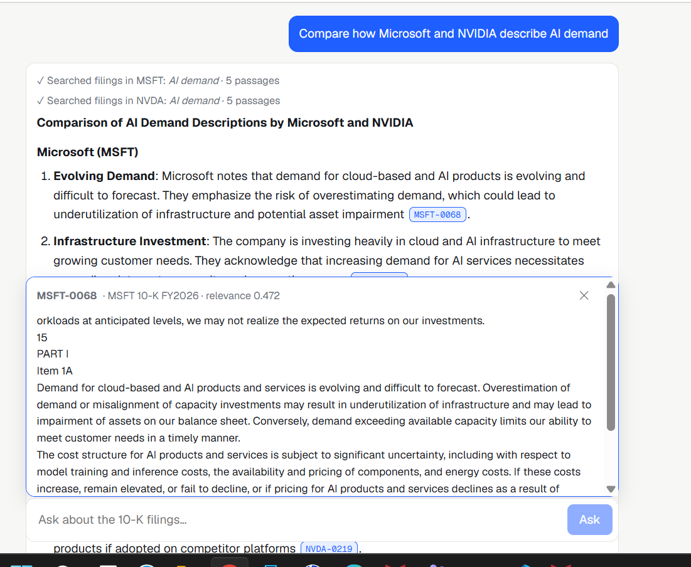
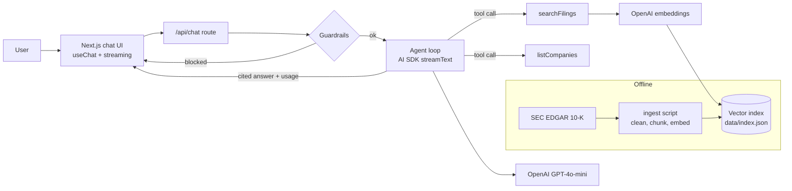

# FinSight — Agentic RAG for SEC 10-K Filings

Ask questions about public companies' annual reports and get concise answers where **every claim links to the exact filing passage** it came from.

FinSight is a tool-using AI agent: it decides which filings to search, runs semantic retrieval over SEC 10-K text, and writes a cited answer. It ships with guardrails against prompt injection and investment-advice requests, live token and cost tracking, and an evaluation harness that gates releases.

**Live demo:** _add your Vercel URL here_



## What it does

- **Agentic retrieval.** The model calls tools (`listCompanies`, `searchFilings`) and decides how many searches it needs, e.g. one per company for comparisons.
- **Cited answers.** Every factual claim references a chunk id like `[AAPL-0123]`; click it to read the source passage.
- **Guardrails.** Deterministic input checks block prompt-injection attempts before the model is called. Retrieved filing text is treated as untrusted data. Buy/sell questions get facts plus a "not investment advice" disclaimer.
- **Cost awareness.** Each answer shows tokens used and estimated cost; the header shows the session total.
- **Evaluation.** A golden question set measures retrieval hit rate and MRR, answer citation validity, and guardrail behavior, and fails CI if quality drops.

## Architecture



## Tech stack

TypeScript · Next.js (App Router) · React · Vercel AI SDK · OpenAI (GPT-4o-mini, text-embedding-3-small) · Zod · Vitest · GitHub Actions · Vercel

## Run it locally

Requires Node 20.6+ and an OpenAI API key.

```bash
git clone https://github.com/<your-username>/finsight.git
cd finsight
npm install
cp .env.example .env.local        # then add your OPENAI_API_KEY and SEC_USER_AGENT
npm run ingest -- AAPL MSFT NVDA  # downloads the latest 10-Ks and builds data/index.json
npm run dev                       # http://localhost:3000
```

Building the index for three companies costs a few cents in embeddings.

## Tests and evals

```bash
npm test                 # unit tests (no API key needed)
npm run eval             # retrieval + guardrail evals
npm run eval -- --answers  # also runs the full agent on answer cases
```

The eval exits non-zero if hit rate, MRR, answer pass rate, or safety checks fall below thresholds set in `scripts/eval.ts`. In CI, evals run automatically when the repo has an `OPENAI_API_KEY` secret.

## Project structure

```
src/app/page.tsx          chat UI with citations, tool steps, usage
src/app/api/chat/route.ts guardrails + agent loop + streaming response
src/lib/agent.ts          system prompt and tools
src/lib/vector.ts         cosine similarity search
src/lib/guardrails.ts     prompt-injection and advice detection
scripts/ingest.ts         SEC EDGAR -> chunks -> embeddings -> index
scripts/eval.ts           golden-set evaluation harness
evals/golden.json         evaluation questions
tests/                    unit tests
```

## Design decisions

- **A JSON vector index instead of a vector database.** A few thousand chunks fit comfortably in memory, keep the demo free to host, and brute-force search takes milliseconds. Swapping in pgvector or Pinecone only means replacing `search()`.
- **512-dimension embeddings** keep the index small enough to deploy with the app, with little loss in retrieval quality for this corpus.
- **Guardrails before the model.** Cheap, deterministic checks stop obvious attacks without spending tokens; the system prompt is the second layer.

## Roadmap

- Hybrid search (BM25 + vectors) and a reranker
- Section-aware chunking (Risk Factors, MD&A)
- More companies and multi-year comparisons

## Disclaimer

For research and demonstration only. Not investment advice. Filing data comes from [SEC EDGAR](https://www.sec.gov/edgar).
