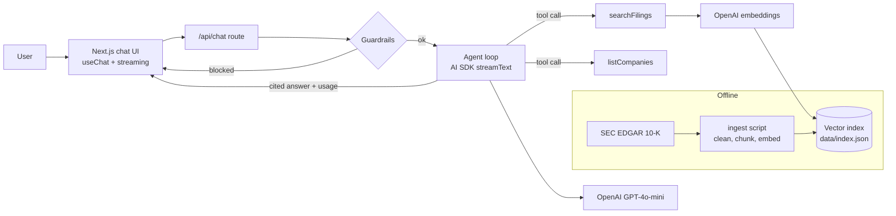

# FinSight — Agentic RAG for SEC 10-K Filings

Ask questions about public companies' annual reports and get concise answers where **every claim links to the exact filing passage** it came from.

FinSight is a tool-using AI agent: it decides which filings to search, runs semantic retrieval over SEC 10-K text, and writes a cited answer. It ships with guardrails against prompt injection and investment-advice requests, live token and cost tracking, and an evaluation harness that gates releases.

**Live demo:** https://finsight-bhavitha.vercel.app


## What it does

- **Agentic retrieval.** The model calls tools (`listCompanies`, `searchFilings`) and decides how many searches it needs, e.g. one per company for comparisons.
- **Cited answers.** Every factual claim references a chunk id like `[AAPL-FY25-0123]`; click it to read the source passage.
- **Multi-year filings and a fiscal-year filter.** The index holds the last three 10-Ks per company. Pick a fiscal year in the UI to restrict every search to it, or ask year-over-year questions and the agent searches each year separately.
- **Guardrails.** Deterministic input checks block prompt-injection attempts before the model is called. Retrieved filing text is treated as untrusted data. Buy/sell questions get facts plus a "not investment advice" disclaimer.
- **Cost awareness.** Each answer shows tokens used and estimated cost; the header shows the session total.
- **Evaluation.** A golden question set measures retrieval hit rate and MRR (including year-filtered retrieval), answer citation validity, and guardrail behavior, and fails CI if quality drops.
- **Faithfulness checks.** Citations alone don't prove an answer is right. The eval splits each answer into cited claims and asks an LLM judge whether the cited passages actually support each claim (supported, partial, or unsupported). A separate check flags any number in a claim that does not appear in its cited passages. CI fails if faithfulness drops below 85%.

## Architecture



## Tech stack

TypeScript · Next.js (App Router) · React · Vercel AI SDK · OpenAI (GPT-4o-mini, text-embedding-3-small) · Zod · Vitest · GitHub Actions · Vercel

## Run it locally

Requires Node 20.6+ and an OpenAI API key.

```bash
git clone https://github.com/enugantibhavitha-png/finsight.git
cd finsight
npm install
cp .env.example .env.local        # then add your OPENAI_API_KEY and SEC_USER_AGENT
npm run ingest -- AAPL MSFT NVDA --years 3  # downloads the last 3 10-Ks per company and builds data/index.json
npm run dev                       # http://localhost:3000
```

Building the index for three companies costs a few cents in embeddings.

## Tests and evals

```bash
npm test                 # unit tests (no API key needed)
npm run eval             # retrieval + guardrail evals
npm run eval -- --answers  # also runs the agent on answer cases and checks faithfulness
```

The eval exits non-zero if hit rate, MRR, answer pass rate, faithfulness, or safety checks fall below thresholds set in `scripts/eval.ts`. Claims the judge did not fully support are printed and saved to `evals/results.json` for error analysis. In CI, evals run automatically when the repo has an `OPENAI_API_KEY` secret (about one cent per run).

The judge defaults to `gpt-4o-mini`. A model judging its own family's output can be lenient, so set `OPENAI_JUDGE_MODEL=gpt-4o` for a stricter audit.

## Project structure

```
src/app/page.tsx          chat UI with citations, tool steps, usage
src/app/api/chat/route.ts guardrails + agent loop + streaming response
src/app/api/filings      filings and fiscal years for the year picker
src/lib/agent.ts          system prompt and tools (with fiscal-year scoping)
src/lib/vector.ts         cosine similarity search with ticker and year filters
src/lib/faithfulness.ts   claim extraction, number grounding, LLM judge
src/lib/citations.ts      chunk id format and citation parsing
src/lib/guardrails.ts     prompt-injection and advice detection
scripts/ingest.ts         SEC EDGAR -> chunks -> embeddings -> index
scripts/eval.ts           golden-set evaluation harness
evals/golden.json         evaluation questions
tests/                    unit tests
```

## Design decisions

- **A JSON vector index instead of a vector database.** A few thousand chunks fit comfortably in memory, keep the demo free to host, and brute-force search takes milliseconds. Swapping in pgvector or Pinecone only means replacing `search()`.
- **512-dimension embeddings** keep the index small enough to deploy with the app, with little loss in retrieval quality for this corpus.
- **Fiscal year lives in the chunk id** (`NVDA-FY24-0012`), so citations show at a glance which filing a claim came from.
- **Claim-level faithfulness instead of a single answer grade.** Judging each cited sentence against only its own passages pinpoints exactly which claim drifted from the source.
- **Guardrails before the model.** Cheap, deterministic checks stop obvious attacks without spending tokens; the system prompt is the second layer.

## Roadmap

- Hybrid search (BM25 + vectors) and a reranker
- Section-aware chunking (Risk Factors, MD&A)
- More companies
- Show faithfulness scores live in the UI

## Disclaimer

For research and demonstration only. Not investment advice. Filing data comes from [SEC EDGAR](https://www.sec.gov/edgar).
